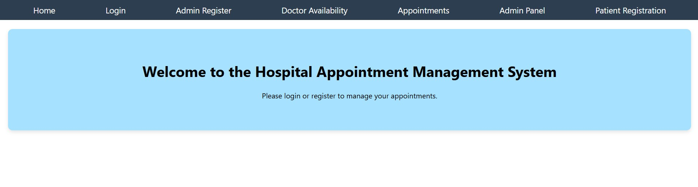

</a>
<h1>Patient Appointment Management System</h1>

•	Designed and developed a web-based patient appointment management system using .NET Core (C#) for the backend and React (TypeScript) for the frontend. 
•	Implemented features such as patient registration, doctor availability management, appointment scheduling, and email notifications. 
•	Integrated JWT-based authentication for secure access to the system. 
•	Developed an admin panel to manage users and appointments, ensuring seamless system administration. 
•	Utilized SQL Server for database management and Entity Framework Core for ORM. 

